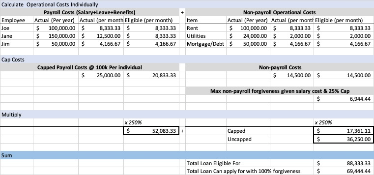

# Hustle Fund COVID-19 US Relief Guide

----

## What's new

_can also find on [twitter](https://twitter.com/will_bricker)_

### 4/7
- Treasury updates [FAQ](https://home.treasury.gov/system/files/136/Paycheck-Protection-Program-Frequenty-Asked-Questions.pdf) around affiliation 

### 4/6

- [Treasury comes out with interim rule on affiliation](https://home.treasury.gov/system/files/136/SBA%20IFR%202.pdf) and [guidance on affiliation](https://home.treasury.gov/system/files/136/Affiliation%20rules%20overview%20%28for%20public%29.pdf)
  - Points affiliation definition towards  [13 CFR 121.301](https://www.ecfr.gov/cgi-bin/text-idx?SID=7655ef612afd00fe4fba93bfe9122ae7&mc=true&node=se13.1.121_1301&rgn=div8) f
    - effectively narrows definition down to equity stake and negative rights provisions (removes common interest and disproportionate ownership clauses)
- updated our information based on that guidance

### 4/3 ( as of 11 AM)

Rocky start to the program, while treasury is reporting +$3.2 Bn in loans, unclear who is getting them and through what lenders

- [list here of people who are lending](https://heavy.com/news/2020/04/apply-payroll-protection-program-sba-covid-19/)
- B of A is accepting applications, but must have existing account, credit card, and previous loan (this is the mitigation of current portfolio risk we were worried about)
- Currently sitting out - FRB, Wells Fargo, Citi, Capital One, Chase
- Rumored to be participating & executing - [First Home Bank](https://www.firsthomebank.com/sbarelief/)  

## Note on Resources

There is a lot of speculation out there. The most reliable resources are from the SBA & Treasury:

- [Treasury Department Portal](https://home.treasury.gov/policy-issues/top-priorities/cares-act/assistance-for-small-businesses)
  - [Treasury Department Borrower Guide](https://home.treasury.gov/system/files/136/PPP%20Borrower%20Information%20Fact%20Sheet.pdf)
- [SBA Portal](https://www.sba.gov/disaster-assistance/coronavirus-covid-19)
  - [SBA PPP Page](https://www.sba.gov/funding-programs/loans/coronavirus-relief-options/paycheck-protection-program-ppp)
  - [SBA Form](https://www.sba.gov/sites/default/files/2020-04/PPP%20Borrower%20Application%20Form.pdf)
  
----

## Our Recommendation

### Look at the PPP Loan First

We Recommend that all our portfolio companies __consider first and foremost the PPP loan__. We believe it has the most favorable terms for our founders

- Potential forgiveness for approved payroll usage (up to 100% of principle)
- No personal guarantee
- No collateral requirements
- No requirement to tie damage directly to COVID-19
- Rate and Term

### Get ready to apply NOW

#### Find a lender if you don't already have a relationship with one

The process will not be smooth for lenders, whether they are currently approved or not. This represents a huge expansion of the existing program:

- ~15x 2019 Deployment to be executed over several weeks
- the onboarding of new partners and new processes
- the definition of many parts of the program is still unclear

Try to get your spot in line now with a lender that can provide you the quickest path to getting your loan

- If you __already have an existing relationship__ with a lender or an entity that is eligible to become one, go there first 
  - lenders are prioritizing existing clients first
  - the requirements to become an approved lender have been relaxed, so many entities will be joining the program
- if you __do not have an existing relationship with a lender__, find a lender that is accepting new customers
  - partial list can be found [here](https://docs.google.com/spreadsheets/d/1wHQrkf0ElDVnEEWJOahr3E6eMsxyZIvPRrpMdjlr37g/edit#gid=0)
  - Gusto's list [here](https://docs.google.com/spreadsheets/d/1tzF2kJGjJtxkLxdWbKLfUtjJGfqGeL7V0dvzlextHJs/edit#gid=1030711345) 
- While the SBA has a [lender math tool](https://www.sba.gov/paycheckprotection/find) to help find a lender, as of now it is not providing reliable results

#### Get your form and associated documents together

- Get your [form](https://home.treasury.gov/system/files/136/Paycheck-Protection-Program-Application-3-30-2020-v3.pdf) ready
- Start to prepare the proper documentation (will vary slightly depending on lender)
  - Expected materials include:
    - Quarterly Payroll IRS filing - Form 941 
      - at least all 4 quarters of 2019
      - Ideally Last 5 quarters (2019+1Q2020)
    - Articles of incorporation
    - Tax Return
      - At least 2018
      - Ideally 2019
    - Bank statements
      - At least from Nov 2019 to Feb 2020
      - Ideally FY 2019 and Jan + Feb 2020
    - Any statements regarding non-payroll expenses
    - Payroll service report if your payroll has fluctuated
    - (Probably) Bylaws and Partnership Agreements
    - (Possibly) W2 & 1099 for each employee
- For newer businesses that do not have previous relationships with qualified lenders, they may be required to provide further documentation around
  - Founder’s personal finances
  - The business structure and plan

### Understand the implications of your application

#### You will have to adhere to all certifications in the form

This includes

- Retaining employee and wage levels
  - forgiveness  will be reduced if there is a decrease in in the number of employees or wages in excess of 25% of total wages during the period.
  - Employers must bring back employees terminated from Feb 15 to April 27 before June 30th
- That current economic uncertainty makes the loan necessary to support your ongoing operations.
- That you have not and will not receive another loan under this program.

#### You will have to account for use of all proceeds

So stand up processes to track spending now.

#### Eligible loan amount & Forgiveness amount

There are two relevant caps to remember

- Employee salary qualifies up to 100K per Year
  - __Impact__ - not all of your salary expenses may be used to calculate loan size
- the maximum amount of the lone that can be applied to non-payroll operating expenses is 25%
  - __Impact__ -  your loan may not be fully forgivable even if you use it on qualified operating expenses

Here is a high level example

_intro VC has created a [google doc](https://docs.google.com/spreadsheets/d/1RL-yqNeLQzMwCi08hsJRzS-6I4m7C7TfMrnv-SmAH2w/edit#gid=1299986469) to help model forgiveness, have not verified accuracy_

### For those founder's worried about eligibility

A lot remains unknown, and information is constantly evolving. As of now, the biggest questions for venture backed startups are around size requirements and the affiliation clause.

What we do know is that certain negative rights by investors on day-to-day operations may trigger the affiliation rules.

Thus, we recommend that founders __discuss with their investors the possibility of changing applicable covenants to enhance your eligibility.__

As of now, negative clauses around day-to-day operations that likely would impact affiliation are (Per [NVCA Guidance](https://nvca.org/wp-content/uploads/2020/03/VC-SBA-Lending-and-Affiliation-Guidance-for-SBA-Loan-Programs.pdf)):

- Making, declaring, or paying distributions or dividends other than tax distributions
- Establishing a quorum at a meeting of stockholders (and likely, by extension, at a meeting of the board)
- Approving or making changes to the company’s budget or approving capital expenditures outside the budget
- Determining employee compensation
- Hiring and firing officers and executives.
- Blocking changes in the company’s strategic direction.
- Establishing or amending an incentive or employee stock ownership plan.
- Incurring or guaranteeing debts or obligations.
- Initiating or defending a lawsuit.
- Entering contracts or joint ventures.
- Amending or terminating leases.

----

## Guide Intro

Most people have heard about the  COVID-19 Aid, Relief, and Economic Security (CARES) Act by now – the $2 trillion stimulus bill passed by the US government to help businesses and individuals impacted by the COVID-19 epidemic.

However, at Hustle Fund, we have seen founders and investing partners have less clarity on what this bill means for them, and how they can or cannot participate.

 We decided to try to bring some clarity for our founders and the venture/startup community more broadly. We have tried to pull together as much information and resources as possible in this piece, and would love to hear your suggestions for what else would be helpful via pull requests or emailing us [here](mailto:deals@hustlefund.vc)

__Please note, none of this information constitutes legal or financial advice. You should consult a legal representative to get information and guidance that is right for you.__

## Guide Overview

At the core of this guide is outlining the available financial aide options for startups

| **Item** | **High Level Details** |
| --- | --- |
| [Loan via CARES Act/PPP](1-Loan_PPP.md)   (CARES act sections 1101-1107) | - For **operating** expenses (Payroll + Current Interest/Utilities/Rent)  - **Amount** : 250% of average monthly operating expenses ($10mm Cap)   - **Terms** : 1% for 2 years   - Possible forgiveness |
| [Loan via EIDL](2-Loan_EIDL.md) (Economic Injury Disaster Loans) | - For **operating** &amp; **non-operating** expenses   - **Amount** : $2mm Max, dependent on the applicant's demonstrated economic injury and ability to repay   - **Terms** : Max 4% Interest, Maturity up to 30 Years   - No forgiveness |
| [Tax Relief](3-Tax_Relief.md) (CARES act sections 2301,2302) | Options to either   - defer 2020 payroll tax payment over the next two years   - receive a 50% credit for payroll taxes for certain employers and employees |

In addition we provide:

- Some helpful [resources](A1-Resources.md) we have found during our research
- A deep dive into control, [affiliation](A2-Affiliation_Control.md), and its implications for VC-backed companies
- An [FAQ](A4-FAQ.md) that we will try to keep updated
